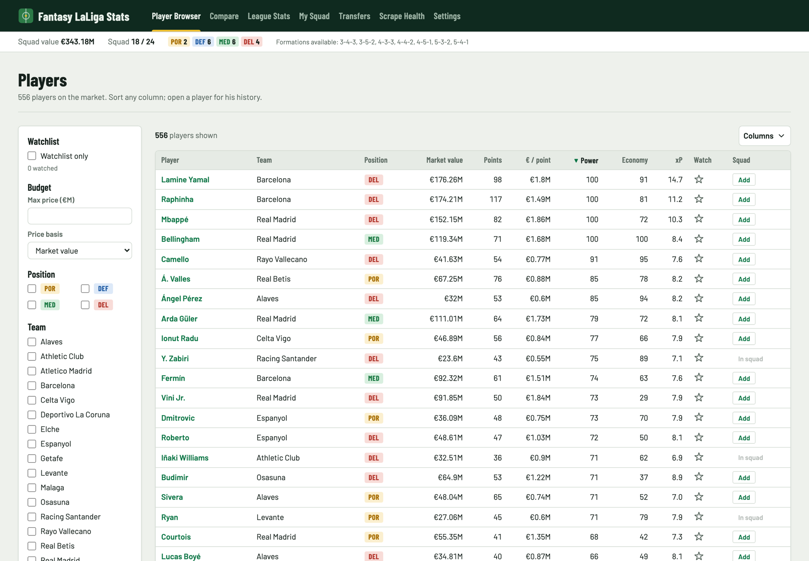
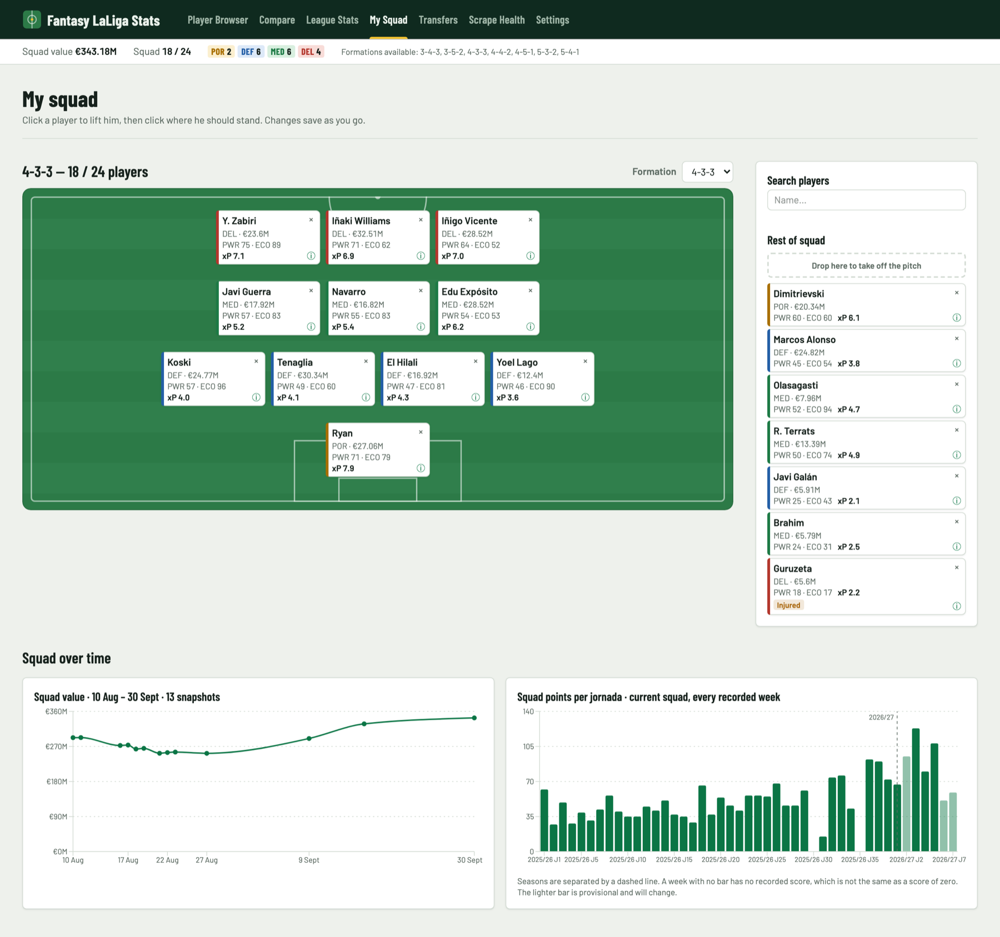
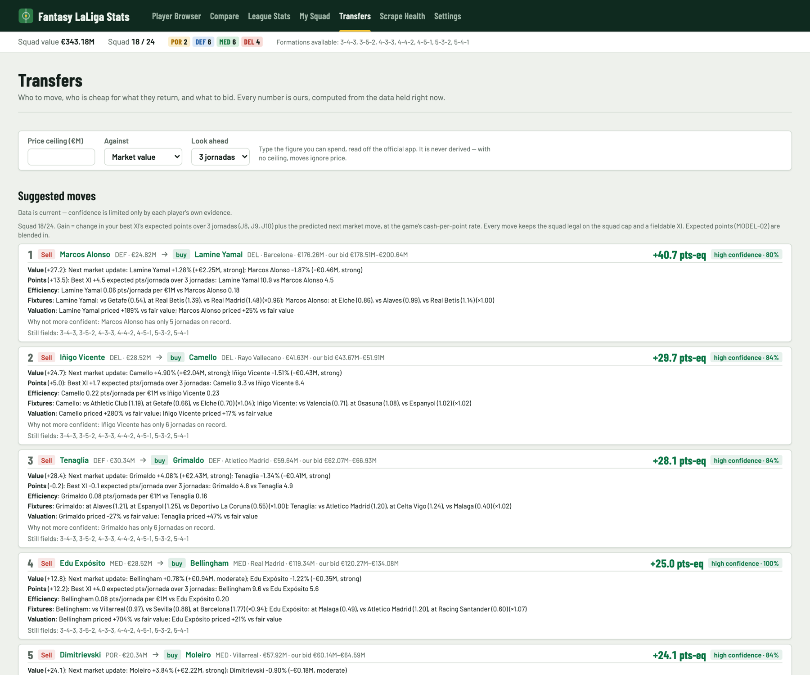
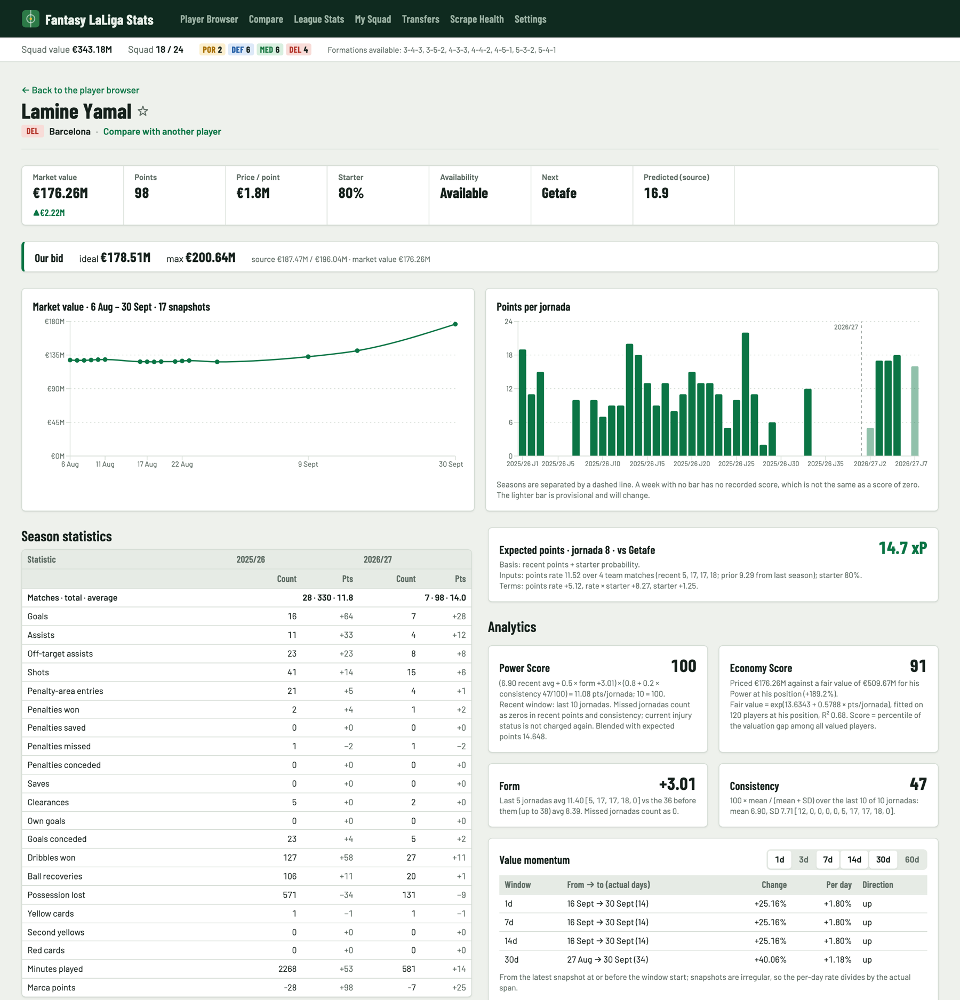
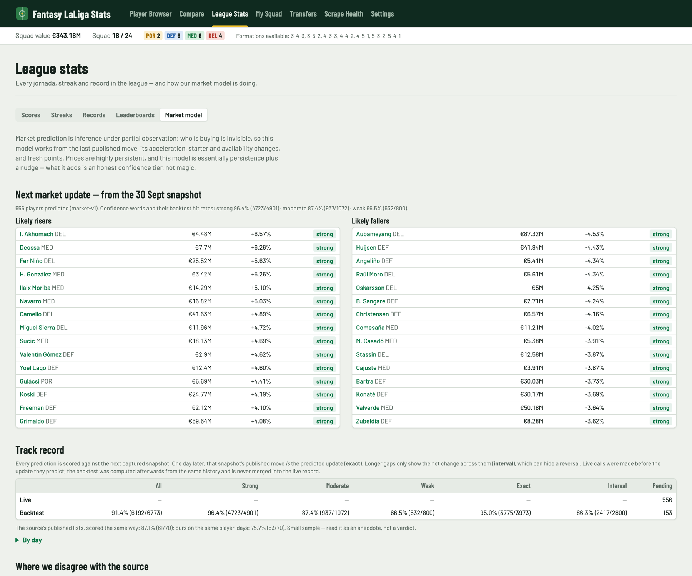
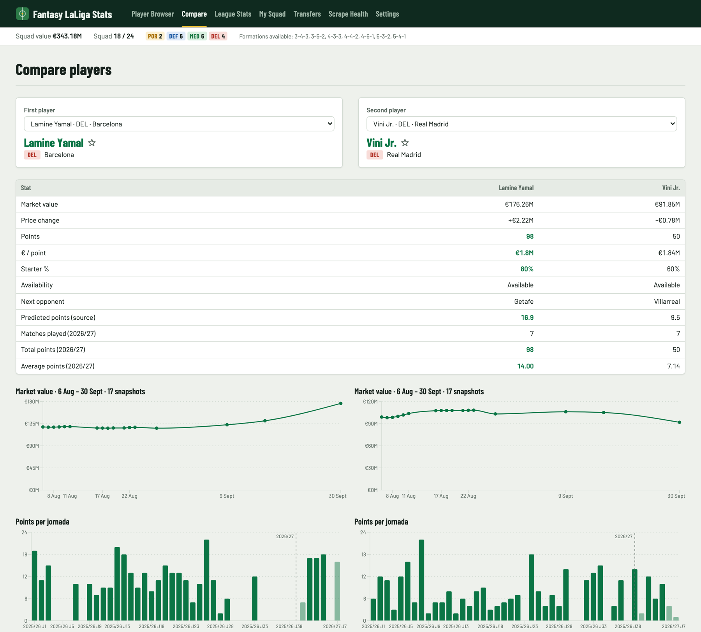
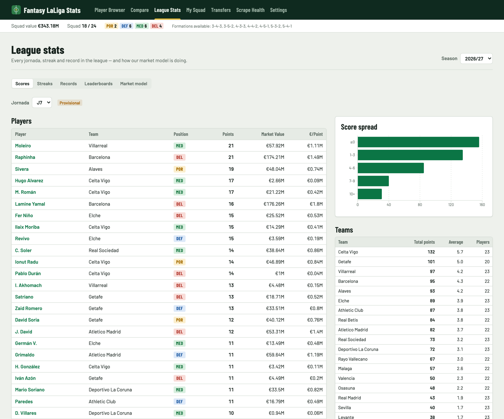
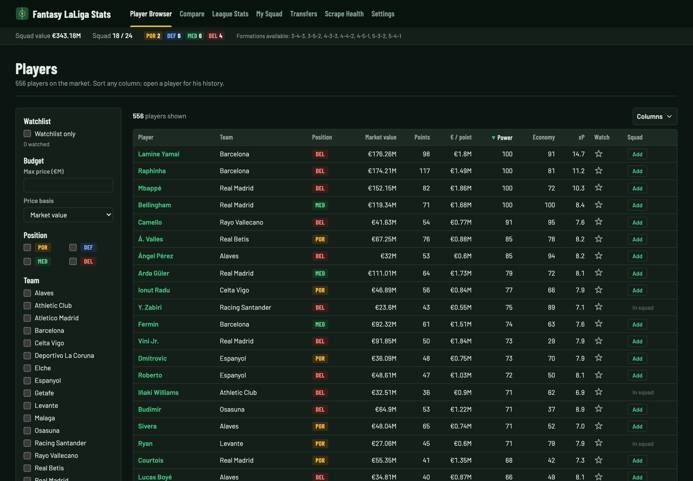
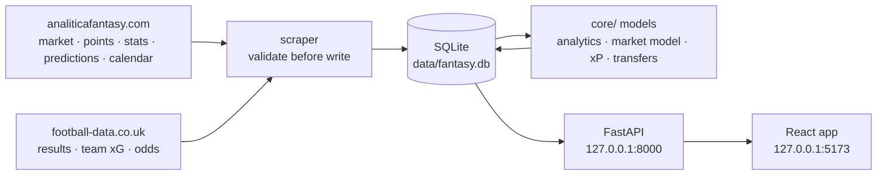

# Fantasy LaLiga Stats

**A personal, locally-run analytics app for [LaLiga Fantasy](https://fantasy.laliga.com)'s
Manager mode.** It gathers more about every player than any single public source shows, runs its
own models on top, and turns all of it into one answer: *who should I be holding right now, and
who should I move?*


[](LICENSE)

> Single user, runs on `127.0.0.1`, no accounts, no cloud. Not affiliated with LaLiga, DAZN or
> any of the data sources below.



---

## Contents

- [Features](#features)
- [Screenshots](#screenshots)
- [How it works](#how-it-works)
- [Quick start](#quick-start)
- [Configuration](#configuration)
- [Refreshing data](#refreshing-data)
- [Updating](#updating)
- [Our models, and how good they are](#our-models-and-how-good-they-are)
- [Development](#development)
- [Project structure](#project-structure)
- [Data sources and scraping](#data-sources-and-scraping)
- [License](#license)

## Features

| Page | What you get |
|---|---|
| **Players** `/` | Every player with market value, price change, points, price per point, starter probability and availability — plus our own **Power Score**, **Economy Score** and **expected points (xP)**. Sortable, filterable by position, team and a price ceiling, with a ★ watchlist. |
| **Player page** `/players/:id` | Market-value history, points per jornada, form, value momentum, consistency and valuation — each metric shows its inputs and the window it used — plus our market prediction, xP with its basis, and our ideal / maximum bid. |
| **Compare** `/compare` | Two players side by side: key stats with the better value highlighted, and their value and points charts. |
| **League stats** `/stats` | Per-jornada scores with tier distribution and per-team analytics, streaks over a configurable window, single-jornada records, leaderboards by any tracked stat — and a **Market model** tab with predicted risers and fallers, their live track record, and where our prediction and the source's disagree. |
| **My squad** `/squad` | Your real squad on a pitch: click a player, click a slot. Reachable formations, squad value and points over time, and Power / Economy / xP on every card. |
| **Transfers** `/transfers` | Ranked **sell → buy** suggestions with the signals behind each one, bargains, the best players per position (with a budget toggle), and our own bid numbers. Every suggestion is checked server-side to leave the squad legal, and confidence visibly drops when the data is stale. |
| **Scrape health** `/health` | Every refresh and every dataset inside it: status, row counts, and the reason when something failed. |

Light and dark themes follow your system setting. Wide tables scroll inside their own box, so the
page never scrolls sideways, down to phone width.

## Screenshots

*Taken with a demo squad, not a real one.*

| | |
|---|---|
| **My squad** — the XI on a pitch, with Power, Economy and xP on every card, and squad value and points over time<br/> | **Transfers** — ranked sell → buy moves, each with the signals that drove it and its confidence<br/> |
| **Player page** — history, season statistics, expected points and analytics, each showing its inputs<br/> | **Market model** — predicted risers and fallers, and the model's own scored track record<br/> |
| **Compare** — two players side by side<br/> | **League stats** — any jornada's scores, score spread and team totals<br/> |

<details>
<summary>Dark mode</summary>



</details>

## How it works



- **One refresh entrypoint** (`python -m scraper.run`) fetches each dataset independently. A
  failing source is recorded on its own and never takes the others down, and a malformed page is
  rejected rather than written.
- **Model code is pure.** Everything in `core/` is free of I/O, so every formula is unit-tested
  in isolation.
- **Rules are enforced server-side only.** Every cap and formation comes from
  [`docs/RULES-LALIGA-FANTASY.md`](docs/RULES-LALIGA-FANTASY.md) via
  `core/rules_data/laliga_fantasy.json`, never hard-coded; the client renders the server's
  verdicts.
- **The schema changes only through Alembic migrations**, and the test suite builds its database
  through the same migrations.

## Quick start

**Requirements:** Python 3.12+, [`uv`](https://docs.astral.sh/uv/), Node.js 20.19+ or 22.12+
with npm. Developed on macOS; Linux should work the same.

```bash
git clone https://github.com/ABO896/fantasy-laliga-stats.git
cd fantasy-laliga-stats

uv sync                                  # Python dependencies (creates .venv/)
uv run playwright install chromium       # browser used by the player scraper
npm --prefix web install                 # frontend dependencies

cp .env.example .env                     # defaults work as-is
uv run alembic upgrade head              # create the SQLite database

make dev                                 # API on :8000 + web app on :5173
```

Open **http://127.0.0.1:5173**. The database starts empty: the banner offers **Refresh now**, or
run `make scrape`. To give the charts and models some history straight away, backfill last
season once:

```bash
make backfill                                                    # 2025/26 points per jornada
uv run python -m scraper.backfill --season 2025 --football-data  # 2025/26 results and odds
```

If a page says it can't reach the API, the backend isn't running — `make api` starts it on its
own.

## Configuration

Settings are read from `.env` (see [`.env.example`](.env.example)) and fall back to sensible
defaults. The ones you're most likely to touch:

| Variable | Default | Purpose |
|---|---|---|
| `DB_PATH` | `./data/fantasy.db` | SQLite database file |
| `RAW_SNAPSHOT_ROOT` | `./data/raw_scrapes` | Retained raw HTML, for debugging a bad scrape |
| `RAW_RETENTION_DAYS` | `7` | How long raw HTML is kept; purged on every refresh |
| `USER_AGENT` | identifies this project | Sent with every request — keep it honest |
| `FOOTBALL_DATA_ENABLED` | `true` | Set to `false` to skip football-data.co.uk entirely |
| `API_HOST` / `API_PORT` | `127.0.0.1` / `8000` | Loopback only by design — never `0.0.0.0` |

Premium-league options (the extra formations and the bench) are toggled in the app under
**Settings**.

> **Testing against a copy of your database?** Point **both** `DB_PATH` and `RAW_SNAPSHOT_ROOT`
> at temporary locations. A refresh purges old raw HTML under `RAW_SNAPSHOT_ROOT`, whichever
> database it is writing to.

## Refreshing data

There is **no schedule, by design**. When the data is stale the app says so and offers
**Refresh now**; `make scrape` does the same from a terminal. A refresh runs nine datasets:

`market` · `jornada_points` · `season_stats` · `points_predictions` · `market_predictions` ·
`fixtures` · `football_data` · `market_model` · `expected_points`

An earlier version scraped daily from `launchd`. Left unattended, it failed silently for eleven
days and lost history that can't be recovered. A refresh that only runs while you're looking
can't fail unseen. The trade-off is gaps in history on days the app isn't opened.

## Updating

```bash
git pull
uv sync && npm --prefix web install      # pick up any dependency changes
cp data/fantasy.db data/fantasy.db.backup-$(date +%Y%m%d)   # before migrating
uv run alembic upgrade head              # apply any new schema changes
```

**Your data is never touched by `git pull`.** Your squad, watchlist, settings and every
snapshot live in `data/fantasy.db`, and your configuration in `.env` — both are git-ignored, so
nothing in this repository can overwrite them. Schema changes arrive only as Alembic migrations,
which alter tables in place rather than rebuilding the database. A migration only removes data
when a feature it belongs to is removed, and the commit that does it says so; the backup above
covers that case.

## Our models, and how good they are

The source site paywalls its market and points predictions, so the app builds its own. Unlike
the source, it **scores every prediction against what actually happened and shows the track
record in the app**. Backtest results at release:

| Model | Result |
|---|---|
| **Market move** (rise or fall at the next update) | 95.0 % correct on next-day calls, against 94.6 % for "same as the last move". Its value is the confidence label: *strong* calls were right 99.0 % of the time, *weak* ones 73.8 %. On the 44 player-days where both could be compared, the source did better (95.5 % vs 90.9 %). |
| **Expected points (xP)** per player per jornada | Against the source's own prediction: slightly worse mean error (2.40 vs 2.38 points), better on large misses (RMSE 3.34 vs 3.41) and at ranking players (Spearman 0.54 vs 0.52). |
| **Power / Economy Score** | Descriptive ratings of a player's recent fantasy output, and of that output relative to price. |
| **Transfer suggestions and bids** | Weights are set by hand, not fitted, and not yet scored against outcomes. Treat them as a well-reasoned shortlist, not an oracle. |

Two limits are worth knowing. There is no permitted source for per-player xG/xA, so xP works from
team-level odds, starter probability and form. And market demand (who is buying whom) isn't
observable at all, so market prediction is inference from proxies.

To reproduce the xP backtest against your own data:

```bash
uv run python -m storage.xp_backtest --db data/fantasy.db --fit
```

## Development

```bash
make test                     # pytest + Vitest
uv run ruff check .           # lint (line length 100)
npm --prefix web run build    # type-check + production build
```

Every change should pass all four. Tests never touch the network: parser tests run against pages
captured from the live sources, which are **not redistributed** with this repository. On a fresh
clone those tests are skipped, with the missing file named in the reason — see
[`tests/fixtures/README.md`](tests/fixtures/README.md) to capture your own.

After pulling a change that adds a migration, back up your database and run
`uv run alembic upgrade head`. A green test suite does not mean your real database is migrated.

## Project structure

```
api/          FastAPI app and routes
core/         pure logic: parsing, validation, rules, analytics, models (no I/O)
storage/      SQLModel models, database session, repository and model-runner functions
scraper/      source adapters (fetch + parse) and the refresh / backfill entrypoints
migrations/   Alembic revisions — the only thing allowed to change the schema
web/          React 19 + Vite + TypeScript + TanStack Query/Table + Recharts + Tailwind v4
tests/        pytest suite (Vitest tests sit next to their components in web/)
docs/         the game's rules and the scraping policy
```

## Data sources and scraping

| Source | Used for |
|---|---|
| [analiticafantasy.com](https://www.analiticafantasy.com) | Players, market values and bids, jornada points, season statistics, points and market predictions, fixture calendar |
| [football-data.co.uk](https://www.football-data.co.uk) | LaLiga results, team shots and xG, pre-match and closing odds |

Access is on demand only, sequential with jittered delays, bounded per run, and sent with an
identifying User-Agent. A 403, 429 or bot challenge stops that source for the run, and nothing
retries around it. There is no proxy rotation and no fingerprint spoofing. The full policy,
including each source's terms as read by this project, is in
[`docs/SCRAPING-POLICY.md`](docs/SCRAPING-POLICY.md) — read it before changing anything in
`scraper/`.

**Scraped data stays on the machine that fetched it.** None of it is committed here, and this
project is for personal, non-commercial use. If you run it, you are responsible for respecting
each source's terms.

Game rules come from the operator's own help centre, never from third-party sites, and are
recorded in [`docs/RULES-LALIGA-FANTASY.md`](docs/RULES-LALIGA-FANTASY.md).

## License

[MIT](LICENSE). The license covers this code only — not data fetched from the sources above,
which remains subject to each source's own terms.
